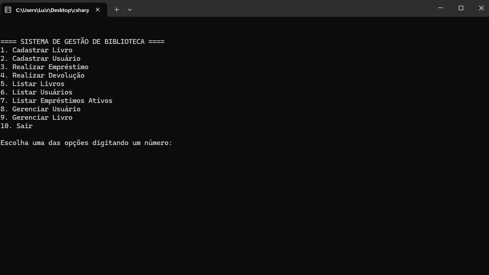

<h1>Sistema de Gestão de Biblioteca em C#</h1>

 

<h2>
  Sistema completo para gestão de bibliotecas com controle de acervo, usuários, empréstimos e devoluções.
</h2>

 

  

 

<h2>
  Funcionalidades Implementadas
</h2> 

<h3>
  📚 Cadastro de Livros
</h3>

<h4>
  Registro completo com;
   título, 
   autor, 
   editora, 
   ano, 
   categoria, 
   quantidade.
</h4>
<h4>
  >Validação de estoque durante empréstimos
</h4>
<h4>
  >Controle automático de disponibilidade
</h4>

 

<h3>
  👥 Cadastro de Usuários
</h3>

<h4>
  Registro com nome, 
  matrícula, 
  e-mail e telefone
</h4>
<h4>
  >Telefone como string para formatos variados
</h4>
<h4>
  >Atualização de dados cadastrais
</h4>

 

<h3>
  🔁 Sistema de Empréstimos
</h3>
<h4>
  Associação entre livro e usuário
</h4>
<h4>
  >Data automática de empréstimo
</h4>
<h4>
  >Devolução prevista em 14 dias
</h4>
<h4>
  >Redução automática do estoque
</h4>
 
<h3>
  🔄 Sistema de Devoluções
</h3>

<h4>
  >Atualização automática do estoque
</h4>

<h4>
  >Cálculo de multa diária (R$ 2,00/dia)
</h4>

<h4>
  >Registro de data real de devolução
</h4>

<h4>
  >Controle de empréstimos ativos
</h4>

 

<h3>
  📊 Relatórios
</h3>

<h4>
  >Listagem completa de livros
</h4>

<h4>
  >Listagem de todos os usuários
</h4>

<h4>
  >Visualização de empréstimos ativos
</h4>

>

